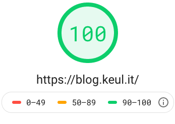

```toc
# This code block gets replaced with the TOC
exclude: Table of Contents
```

# Medal, medal, medal!

Most of you will recognize the following image.



This is a score from Google [PageSpeed Insight](https://developers.google.com/speed/pagespeed/insights/) service, this one is particular is taken from this blog's homepage (thanks Gatsby).

Many generators and tools recently started promoting how cool they are just saying "Install _Replace-This-
With-Fancy-Technology_ and you'll reach values like this!".<br>

Don't misunderstand me: a score value like this can't be bad!
Having an high value means that you are providing a fast site (with a wider meaning for "fast") but the World Wide Web **is not just composed by static blog generators**.<br>
Reaching a minor value with a total different kind of service can probably be a great results too.
You can always improve but _every improvements has its price_.

So… if you just want a medal that says "Your score is 100" maybe there's a cheaper way…


## Web Vitals

Let me go partially off-topic for a few lines.

A pretty new trend, already integrated in [PageSpeed Insight](https://developers.google.com/speed/pagespeed/insights/) and Lighthouse, are [Web Vitals](https://web.dev/vitals/) quality reports.<br>
What I like of Web Vitals is the new way of giving score to a Web page by not simply rely on how fast (classical meaning of the word) the page is but measuring some front-end behaviors instead.

A very important note: [Web Vitals will be officially a rank factor by Google Search](https://developers.google.com/search/blog/2020/11/timing-for-page-experience) sooner. 👀

## Gifted technologies and stacks

Having a full-green score can be easy for a static blog, not so easy for other kind of applications.

My general impression (let's assume there's a "change my mind" meme here):

- if you are using a server side rendered only page it will be easy for you to have an high score, whatever technology or language you are using.
- if you have a lot of client side code (like this blog… Gatsby is using 250Kb of JavaScript) you can still have a very fast site if you are using node and [server side rendering](https://developers.google.com/web/updates/2019/02/rendering-on-the-web).
- there are still kind of resources that are impossible (or very hard) to be optimized even if you are in one of the cases above.<br>
  As an example: interactive maps or heavy client-side only libraries.

But there's a huge world of pages and application out there that are **not using JavaScript on the backend** and still needs a lot of JavaScript on the front-end.<br>
Some of these applications will never reach a 100 score, but trying to improve them is always important.

# A "slow" application

A service I'm working on is an example of "hard to be optimized" case:

- Python on the server
- A lot of JavaScript on the front-end

In this service we are not providing _an_ application, so something we can hyper-optimize, but subscribed users can build applications themselves using a set of widgets and displaying them on a page with a user defined layout.
A lot of complexity, a lot of features, endless possible applications.

Different applications build with this service use slow widgets (resulting on slow score on PageSpeed) while others can just render images and text (getting quite good score).

_Please note_: I'm just interested on _mobile_ score.
Desktop scores are much higher, but traffic analysis explicitly shown a mobile-first traffic.

Let's be clear: no application's score in this service is greater than 80.
A "quite slow application"™ scores is like this:


## Chrome UX Report

First element to note: the red-highlighted section.
This is something pretty new for me but with huge impact.<br>
In this Chrome centered World Wide Web there's another very interesting tool available: the [Chrome User Experience Report](https://developers.google.com/web/tools/chrome-user-experience-report), where real-world Chrome data are available for detailed analysis.

This is amazing (although scary as I found this yet another push on Chrome market domination) because we have available data or _real users_, sharing _real Chrome measures_.

When there's enough data collected for a page, this dataset is accessible:

- on the PageSpeed Insight report and, even more interesting
- using [Big Query](https://console.cloud.google.com/bigquery?utm_source=bqui&utm_medium=link&utm_campaign=classic&pli=1)

I just scratched the surface of Big Query, but it's an amazing tool.

This is totally different from a dedicated tool (like Lighthouse of PageSpeed Insight are) that manually check pages: these kind of services are great, they simulate slow network when needed, but they always act as a "first user visit".<br>
A real Chrome browser from a real user crawling the same page can be, for example, a returning user with cache filled.
Collected data can be significantly different.

## Score

In the same image you can see Web Vitals scores and _Lab data_ section containing other estimated measurements.

Moving down there's another interesting section of the report:


Before digging into details note the highlighted red-bordered section: these suggestions **don't directly affects the score**.
Keep this in mind.

### Preload key requests

As you can see from the report above, it seems we have a very big opportunity here by fixing this lone red warning.
The "preload key request" is a well know technique (I already wrote a [walkthrough about prelaod](/link-preload-a-walkthrough) in another article so I won't detail this here).

Instead I want to focus on the value: what exactly means "_Estimated saving: 2.91 s_"?
The "Speed index" is 5.6s… would that means I can reduce Load time of more than 50%?!

If we expands details, there's a link to another page where is explained [how Speed Index works](https://web.dev/speed-index/?utm_source=lighthouse&utm_medium=unknown).

At the section "_What Speed Index measures_" we read:

> Speed Index measures how quickly content is visually displayed during page load. Lighthouse first captures a video of the page loading in the browser and computes the visual progression between frames. [...]

# Implementing preload

We know that PageSpeed timing for this page can't be trusted, but a promise about 50% time improvements worth a try.

So, let's make Speed Index happy.

## Generate a manifest file

The report indicate 3 resources eligible for preloading:


As I said above we can't simply preloading them in every page for multiple reasons:

- Our backend is decoupled from the front-end, it's a totally different language and we are using resources hashes in filename to improve strong HTTP cache.
- These 3 files are requested by _this_ application.
  If I open another application in the same platform they can be totally different.

Starting form the application configuration (so: when still on the backend) we know in advance which type of resource will be needed.
What I'm missing is a way to assign a "name" to the actual resource filename.

This is where the creation of a **manifest file**, by using [webpack-manifest-plugin](https://www.npmjs.com/package/webpack-manifest-plugin), can help.

A manifest file (commonly distributed as `manifest.json`) can contains a key/value set of resource names and actual resource filename.<br>
A resource's name change only when important changes are done in the JavaScript code, while the filename contains hashes and change more frequently (although not very often if you configured webpack properly).

The idea is to let the backend load the manifest file and make it aware of general front-end structure.
Please note again: the manifest file is generated by the front-end build.

An example.
The Python backend knows that this application will make use of "select" (key) widget and can inject into the page the "select-aei040f.css" it found on the manifest (value).

The added complexity is minimal, although not 0: if we add new widgets in the front-end, or we perform heavy refactoring that change webpack chunks structure, we'll need to change the backend too, and we don't have an automatic way to keep them in sync.

## Measure

Skipping boring implementation details, now we have PageSpeed happy although at first glance the score seems not changed. 🤔<br>
But I'm not a fan of "at first glance" so it is important to **measure performance change properly**.

One way could be to run PageSpeed report multiple times manually, then copy/paste results in a spreadsheet to calculate a mean value, but this will be:

- boring
- slow

To have an efficient analysis I need to repeat the test many times.
Just calling PageSpeed report 10 times (multiply 2, because I need to take results from old and new configuration to perform a comparison, and maybe repeat the same for many different applications) it will take me too much time.

Luckily [PageSpeed provides an API](https://developers.google.com/speed/docs/insights/v5/get-started) which can help us to automate the process!

Use of this API is quite simple:

```bash
curl "https://www.googleapis.com/pagespeedonline/v5/runPagespeed?url=https://mydomain.com/apps/myapp&category=performance&strategy=mobile&key=<APIKEYHERE>"
```

This API call will returns a detailed JSON, but just using command line we can extract the only the interesting value by using [jq](https://stedolan.github.io/jq/):

```bash{2}
curl "https://www.googleapis.com/pagespeedonline/v5/runPagespeed?url=https://mydomain.com/apps/myapp&category=performance&strategy=mobile&key=<APIKEYHERE>" | \
jq '.lighthouseResult.audits["speed-index"].numericValue'
```

Now I can perform this query call multiple times and put everything in a file:

```bash{1,3,4}
for i in {1..50}; do \
curl "https://www.googleapis.com/pagespeedonline/v5/runPagespeed?url=https://mydomain.com/apps/myapp&category=performance&strategy=mobile&key=<APIKEYHERE>" | \
jq '.lighthouseResult.audits["speed-index"].numericValue' >> results.txt \
; done
```

Now my `results.txt` file contains an easy-to-copy-paste list of numeric values like the following:

```python{5,11}
6350.836698217617
7246.856997948271
6292.581487752566
6140.024427264467
3674.497679057053
7267.581138462512
7059.26715937287
7267.8099425262935
7562.374367799673
7283.9890370289195
3579.2184399130924
7160.957117498816
…
```

**Note**: As you can see in the list above we have some faster entries.
Every page load are inside a 6.0 to 7.5 seconds range, but sometimes we have a ~ 3.5s entries.

Fun fact: these are some very _slow_ page load that PageSpeed erroneously register as super fast.<br>
Why?

This because sometimes a single widget used in the application (that internally rely on other network service to be fully displayed) takes too much time to be fully loaded, and PageSpeed wrongly interpret this case as a "page is loaded.

> Hey! I see a big light-gray placeholder here and nothing new has been loaded for a while!
> I think this is the final result of the loaded page!

You can easily check this by checking the preview screenshot provided by PageSpeed.

For this reason, and because sometimes you can also have network issue that make the HTML page to be loaded very slowly, it is not recommended to just take a simple mean value: you must remove noise like in the case above.

## Show me numbers

Some of my real final results follows.

|               | No key requests preload | With requests preload |
| ------------- | ----------------------- | --------------------- |
| Application 1 | 6.77                    | 6.49                  |
| Application 2 | 6.26                    | 5.95                  |

So… the performance trick works, isn't it?
It seems so… I gained at least ~250ms so I can be happy.
Or not?

Wait: where is the 2.91 seconds gain promised? 🧐

# Do not just apply everything Google PageSpeed says

Now the Big Question™.

> Is this performance gain worth the complexity introduced?

IMHO it always depends from numbers and complexity.
In my case… _meh_… 🤷‍♂️

250ms can be a big gain, but we have many applications that are slower than this and I cannot forget the server side complexity introduced that is technically tiny, but as I said could other changes in future.

What is clear is that: 2.9s gain was an hoax.

My final suggestion: do not just apply everything Google says without measure real benefit, or do it if your final scope is to have a everything-green score to show to your mum.
