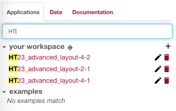
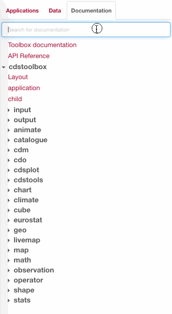

```toc
# This code block gets replaced with the TOC
exclude: Table of Contents
```

# A resume

An application we developed started suffering a degradation of performance when using a small feature:
main thread was busy performing regex for searching inside _many_ text sources.

Using client side regex was not a good idea from the beginning, the best fix could be moving this complexity server side, but how can we fix the issue quickly, waiting for a new API?

Web [Workers](https://developer.mozilla.org/en-US/docs/Web/API/Worker) to the rescue!

# Introduction

This story begins with a product: a Web based programming IDE.

This application is quite huge and complex, but here we'll just focus on a small feature: a *live documentation search* in a tree of documents.<br>
When we started developing this, the search was simple: just autocomplete names of documents.

As all documents are bulk loaded from an API, we implemented the search on the client: a `String.indexOf` plus use of [react-highlight-words](https://github.com/bvaughn/react-highlight-words) was enough.



# An additional search feature

Later, in the documentation tab, we received a new feature request: to be able to **search inside the text of the document**.

Before digging into this let' recap the current status:

- we receive the whole tree at load time
- these documents changes rarely (we can cache it in the browser for a short time)

Introducing a server side live search from the beginning doesn't worth the additional complexity (you know... premature optimization) and user performance would have been _worst_ in my opinion (due to network latency).

But would this be still true if we add additional (big) text for every entry and we perform regex search inside them?
Let's see:

- the final JSON, with documentation text included, was just a few KBytes more (note that the **feature is loaded asynchronously**... 100 KBytes of additional JSON, cached in the browser, are just OK)
- keeping the search on the client? The IDE mainly targets desktop environments and modern browsers
- I did a test with CPU throttling and it was "good enough": typing was a little less reactive, but OK.

So: let's keep the search on the client! 🎉 🎉 🎉

# Good enough is not good enough

(_BTW I don't like this sentence, because most of the time "good enough" is just good enough_)

I did a wrong evaluation: I tested the current status of the application and not considered the _evolution_.
I'm not talking about potential evolution (this would be again premature optimization) but evolution already programmed:

- documentation **receive contribution from outside**: there's a community of contributors that add new tools (not too much) that goes directly in the documentation.
- a team of colleagues and external experts were in charge of **reviewing the documentation**: documentation was changing, becoming cleaner, better organized.
  And _longer_.

# Browser is stuck

So one day a user asked why documentation was "soo slow".

It was not just slow... the whole browser is freezed waiting for search to be completed.



Do you see? As far as I start typing, focus on the input field seems to disappear for few seconds, and during this time the page is unresponsive.

# Analysing the problem

This contents tree is not so small anymore... now we have more that 250 elements in there (folders and documents) for more than 300 KBytes size (excluding gzip).

Every time I have a node in the tree I run something like this (_pseudocode alert_):

```jsx{5}
function ADocumentationTreeNode() {
    ...
    let descriptionNode = null;
    if (filter) {
      const ellipsedText = searchIntoText(text, filter);
      if (ellipsedText) {
        const textNode = <Pre>{highlightText(ellipsedText, filter)}</Pre>;
        description = (
          <Tooltip
            text={textNode}
            ...
          >
            <Icon />
          </Tooltip>
        );
      }
    }
    ...
};
```

I hope it's enough simple to follow: we have a `Tooltip` component which display a `textNode` when hovering an `Icon`. 🕺

**Note**: if you are asking "_are you running this also for items inside closed folders?!_" the answer is _yes_ as we need to automatically expand the tree when an entry is found.

In the code above the problematic (slow) line is the highlighted one: this `searchIntoText` function is the one that execute a regexp on the text, and return only a part of the text truncated with ellipsis.
A _single_ call to this is not an issue, but is now repeated hundred of times.

# Optimizations

A couple of small optimizations are possible there.
Both of them should have been there from the beginning.

## Optimize regexp

Writing an high-performance regexp is important and I suspect it's not a so well know topic,
I like spending time into this thanks to a small book I read years ago.
There's few well know tricks that I can't apply here, but one important one is the usage of [flags](https://developer.mozilla.org/en-US/docs/Web/JavaScript/Guide/Regular_Expressions#Advanced_searching_with_flags_2).

Out regexp pattern was using the global (`g`) flag.
Do we need it?
No... `searchIntoText` just need to find the first occurrence!

But is this _really_ making any difference?

Try to open you `node` console (or the browser one) and put a giant text in there:

```JavaScript
text = `Lorem ipsum dolor sit amet, corrumpit...

[A LOT OF MORE TEXT]

Est vocent intellegam et, pro molestie intellegebat te. Ne possim iriure cum.`;
```

Now let's define two similar patterns:

```JavaScript
pattern1 = /lorem/ig
pattern2 = /lorem/i
```

Now let's try the operation multiple times:

```JavaScript
console.time('global'); for (let i=0;i<300;i++) pattern1.exec(text); console.timeEnd('global');
console.time('not global'); for (let i=0;i<300;i++) pattern2.exec(text); console.timeEnd('not global');
```

Time can vary a bit, but the non-global search is _a lot_ faster.
This largely depends on the text length and regex complexity, but for a long text (4000+ words) I have an average of 800ms versus 100ms for a non-global search.

## Debounce input

In React you commonly have a state, representing the user input, and you pass it down to other components.

This time we have that user input is triggering an expensive operation, so:

- Be sure to not trigger this operation when not useful.
  In our case: we don't need to look for text match when the user inserted less than 3 (or maybe more) chars.
- Most important: **debounce the state change while user is typing**

Last one is the most important: if we set the min chars to 3 and the user is typing the word `animate` we are repeating the operation again and again for all of the following words:

- `ani`
- `anim`
- `anima`
- `animat`
- `animate`

...while just waiting for `animate` is enough.

## Did we fixed the issue?

Fix above provided a slightly better response, but not enough.

The main problem is the regex complexity: our one is not just a simple search for a word because we need to address ellipsis.

# How to fix this issue

The **real** fix for this issue is to move the search server side.
Fullstop.

We can keep client side search for titles, but moving text search in an asynchronous API call would probably be our best option.

A server can fast enough (even if your old PC or legacy smartphone is not) and is generally more efficient to search for text.
Think, for example, at full text search feature on PostgreSQL or Elasticsearch.

# How to quickly fix this issue

But in our case designing this new API requires some time, while the issue is at high priority.

OK, so our regex execution is slow.<br>
But is this our real problem?
No...

We can wait for a search result as far as it's asynchronous (if we add an API call this would work in the same way, probably even slower than a client side operation) but **we can't allow the browser to became unresponsive**.

That's the point: can we make the search asynchronous?

## Workers to the rescue

Welcome to JavaScript an (historically) single-process and single-threaded.

I like JavaScript because a lot of stuff is asynchronous by default (using a syntax that is easy to be understood... I'm looking at you Python) so it shines when you need to handle a lot of concurrent I/O, but we are still inside a single event loop.
Is this Windows 95™? 🤷‍♂️

So, in JavaScript you can delay stuff "for later" or to next tick, by using `setTimeout`, `setInterval`, `requestAnimationFrame`, ... but you should never block the thread, you can't efficiently perform a long CPU intensive operation.

Until Workers has been introduced.

A Worker is a background task (this time, for real) that execute in a **separate thread**.
Web Workers are one of the technology behind bigger brother Service Worker.
It has some limitations, it can't touch the DOM for example, but can communicate with the main thread using messages (so asynchronously).

A Web Worker usage is not exactly straightforward as running a thead in programming language, using Vanilla JS you should run something like this:

```JavaScript
myWorker = new Worker('worker.js');
```

### workerize

As you can see a Web Worker works by running JavaScript _module_, you can't easily run a function in a thread (due to limitations discussed above).

But there's many additional libraries that make things easier.

- [Comlink](https://github.com/GoogleChromeLabs/comlink) is a Google library that make Workers usage easier
- [workerize](https://github.com/developit/workerize) is another option: just few bytes of library

I took workerize because it claims that you can use it with a string or with a function, but [this is not that easy](https://github.com/developit/workerize/issues/37).<br>
However the library works as expected.

👇

### First iteration: move regex evaluation in a Web Worker

The idea.
To have something like this (_super pseudocode alert_):

```jsx
function AnotherDocumentationTreeNode() {
    ...
    let descriptionNode = null;
    if (filter) {
      const onDone = function(filteredText, filter) {
        if (!filteredText) {
          return null;
        }
        return <Pre>{highlightText(filteredText, filter)}</Pre>;
      };
      descriptionNode = (
        <WorkerizedTooltip
          callable={ellipsBlock}
          onDone={onDone}
          params={[description, filter]}
          waitIndicator={<WaitIcon />}
        >
          <Icon />
        </WorkerizedTooltip>
      );
    }
    ...
};
```

Let's start from simple things, so bottom-up:

- we display `<Icon>` when we are done
- in the meantime we display `<WaitIcon>`
- `onDone` is a function that receive results when we are done, and returns a new component to display in the tooltip
- `callable` is the slow-as-hell function to make asynchronous, and we will pass `params` to it.

Note that we can't simply do `callable={() => {ellipsBlock(description, filter)}}` due to how Worker are designed.

Now all of the black magic is inside `WorkerizedTooltip`.<br>
This is the `render` method (yeah, I know I know... no hooks in this project. Is a old React version):

```jsx
  render() {
    const { children, callable, onDone, params, waitIndicator, ...rest } = this.props;
    const { text, waiting } = this.state;
    if (waiting) {
      return waitIndicator;
    }
    return (
      <Tooltip text={text} {...rest}>
        {children}
      </Tooltip>
    );
  }
```

Just a wrapper behind the old `Tooltip`.
Now we need to turn this `waiting` state on and off, how to do this?

```JavaScript{6}
  async update() {
    const { callable, params, onDone } = this.props;
    this.setState({
      waiting: true,
    });
    const worker = workerize(`export ${callable.toString()}`);
    const result = await this.worker[callable.name](...params);
    if (result !== null) {
      this.setState({
        text: onDone(result, ...params),
      });
    }
    this.setState({
      waiting: false,
    });
  }
```

This (async) `update` function should be called from other common lifecycle events, or you can simply replace it with (async!) `componentDidUpdate`/`componentDidMount`, this depends on your application lifecycle.

Note highlighted line.
This is a documented way to use workerize lib: by inlining a JavaScript source exporting a function.
It can resemble you the use of `eval`, but thanks to `Function` object property we can get the source code in a more tidy way.

This implementation has a lot of issues.<br>
If we open the network tab we see a lot of (fake) network activities.
I suspect because this approach is generating multiple workerize/Worker objects, one for every `update` call, performed by hundreds of instance, still not 100% sure why browser show this as network.

But is the browser still stuck?
No!
Now is working smoothly.

So, we "just" need to optimize.

### Second iteration: just one workerize object

