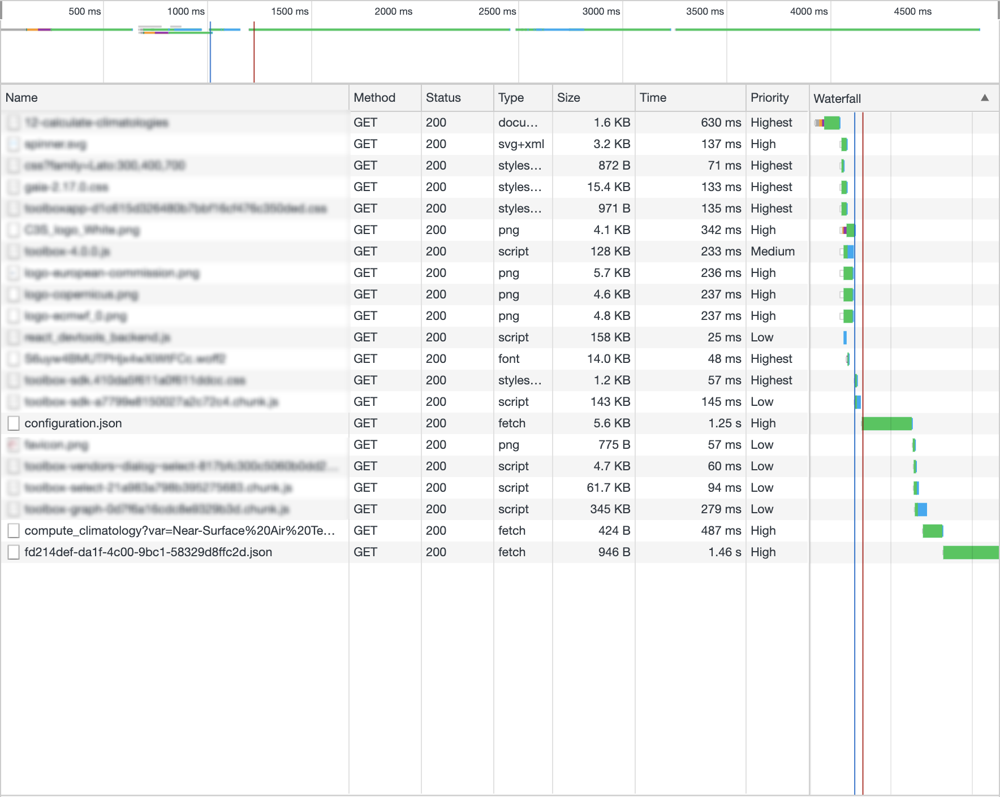
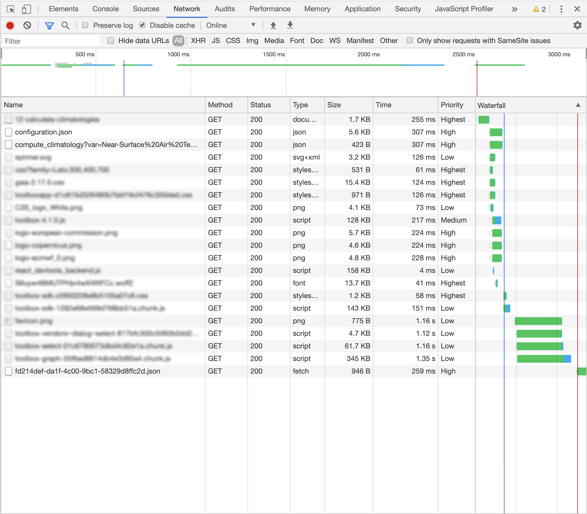
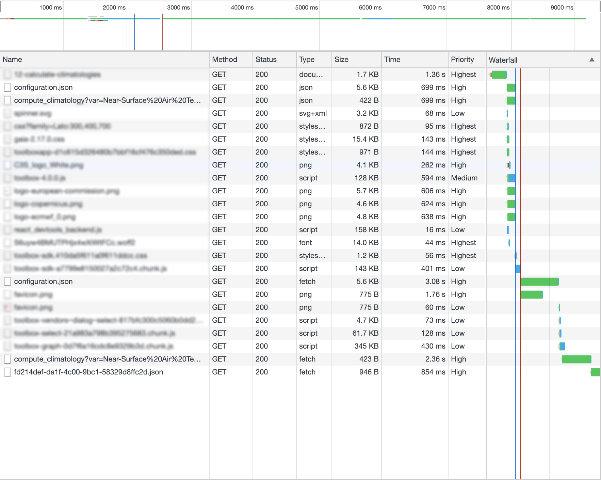

```toc
# This code block gets replaced with the TOC
exclude: Table of Contents
```

# What has been achieved

Last week I worked on an front-end performance optimization task for a project.
The front-end of this application (my domain) is a React application but this post has nothing to do with React.<br>
Information here can be applied to any JavaScript application.

What I addressed is moving from a situation like this...



...to something like this...



Before focusing on the top overview timeline where it seems it goes from 4.5 sec to 2.5 sec, let me say this is not strictly true: this is a development server, response time change a lot, browser cache is disabled (because we are particularly interested on new users).

_But_, in any case, every test I did never gone under **1 second gain**, which is _a lot_.

Did I refactored my JavaScript code from scratch? Did I removed an hidden task for calculating π? Did I changed my machine or network to a 10x more powerful one?<br>
No!

I "simply" implemented a couple of [resource preload](https://developer.mozilla.org/en-US/docs/Web/HTML/Preloading_content) using `link rel="preload"`.

What this meant for my application?
Two very important calls are not serialized anymore but **performed in parallel with no side effects**.

I'm writing this post because _this has not been exactly easy_ and I not found a single tutorial that contained all of the issues I encountered.

Now, please sorry, but to fully understand further you need some context on the application.

# Few information about the service

Let me introduce some general information on the application itself.

- The JavaScript application on its own can't do nothing interesting
- The application need to download a **configuration.json** file

  

- This configuration file contains a lot of data but what it's important for us is:

  - an URL to a remote API service
  - default parameters to run this **remote process execution**.

  This remote call must per performed as soon as possible.

  

- Based on the configuration, the application can load additional chunks of code (some of them are pretty big and not frequently used, so it's OK to not waste user's bandwidth downloading them for every user)
- The API response depends on the configuration itself and commonly contains URI to additional resources (most of the times: images or JSON files).

  Downloading this final data is essential for displaying something useful to the user.
  In our simple example the final output is a JSON compatible with the [plotly.js library](https://plot.ly/javascript/).

  

This was the general workflow of the application, but let me highlight more:

- Until the main JavaScript code has not been loaded we display a spinner (I know, I know... no SSR yet).
- Until the `configuration.json` has not been loaded we can't say anything about what to show on the screen, so we just display a loading indicator.
- When both the main JavaScript source and the configuration file are loaded we can both:

  - start the execution (by calling the API)
  - load additional chunks (if needed).

- All these resources are cached in the browser (but as I said we were working for improving the first-visit journey) and in a **caching HTTP reverse proxy**.

  Almost all resources in the list, apart the main page which is cached for a short time, never change.
  _Please note_: effects of this caching layer is not visible in this example.

One final note: you probably already noted that the API call is performed with an HTTP GET method (with parameters as query string arguments).
The application can (and most of the times will) use a more common HTTP POST too.

When applicable (not applicable to every kind on remote process) we use GET.
GET make the request call easier to be cached in the reverse proxy; caching a POST is doable but, in my limited experience, not so easy to be controlled/inspected.

# The journey to the performance land

## What we can do better?

Let recap our weak points.
We have three main entities:

- The JavaScript main file
- The configuration file
- The request API call

The former version of the application was downloading and parsing bundle _then_ fetching the `configuration.json` _then_ calling the API.

But our server (a Python based API) is already aware of the JSON file itself (because _it_ generate the configuration).
So ideally we can start the configuration call earlier.

And this not ends here: as the configuration contains every information for performing the initial API call we still don't need the JavaScript application to be up and running to perform it.

So: ideally we make those three calls _concurrent_.

Now let's detail every attempt to reach this by using the powerful preload pattern.

### What a preload pattern should do?

Briefly speaking: the browser try to fetch the resource at higher priority (to be honest, priority depends on the `as` attribute) so when your application try fetch the resource the browser would say "Hey! I already have this stuff".

Also notable: browser cache is still applied: if the preloaded resource is in the browser cache, no new load attempt is made at all.

> **Note**: `link` with `rel="preload"` is [currently only supported by Chrome and Safari](https://caniuse.com/#feat=link-rel-preload) but, as you can guess, this covers 80% of the browsers out there.
>
> This is enough for supporting it has it's fully backward compatible.

## Enabling preload

I was already aware of some of the issues I encountered, but I hoped that all could work by simply doing few changes.
_Spoiler alert_: most of tutorial you can find on the Web just say "_add a preload and live happy_".
Liars.

My first attempt: added what's follow to our template file on the server (syntax should be straightforward although this is a Jinja template):

```html
<link rel="preload" as="fetch" href="{{ configuration_url }}" />
<link rel="preload" as="fetch" href="{{ run_url }}" />
```

Not much to say: just tried to put URIs to `configuration.json` (`configuration_url`) and API with query string (`run_url`) in a `preload` elements.

This didn't worked.
Even worst: resources are **loaded twice**:



Hey!
Preloading _is working_... so why the browser don't reuse the same information?

The solution can be found in the console:

> ````
> A preload for '.../configuration.json' is found, but is not used because the request headers do not match.```
> ````

Plus another similar message for the API call.

Just Googling for this and you will find a general answer:
to be reused, a preload request **must have identical headers** to the default request.

Easy... or not?

For now let's focus on the configuration request only, for brevity.

> **Note**: from now on: stuff inside the `<...>` placeholder is omitted but is never an issue, so equals on both preload and canonical requests.

These are the headers of the preload requests:

```
:authority: <...>
:method: GET
:path: <...>/configuration.json
:scheme: https
accept: */*
accept-encoding: gzip, deflate, br
accept-language: <...>
cache-control: no-cache
cookie: <...>
pragma: no-cache
referer: <...>
sec-fetch-dest: empty
sec-fetch-mode: no-cors
sec-fetch-site: same-origin
user-agent: <...>
```

...and these headers sent with the JavaScript fetch:

```
:authority: <...>
:method: GET
:path: <...>/configuration.json
:scheme: https
accept: */*
accept-encoding: gzip, deflate, br
accept-language: <...>
cache-control: no-cache
content-type: application/json
cookie: <...>
pragma: no-cache
referer: <...>
sec-fetch-dest: empty
sec-fetch-mode: cors
sec-fetch-site: same-origin
user-agent: <...>
```

Let focus on differences:

| preload                   | fetch                            |
| ------------------------- | -------------------------------- |
| _nothing_                 | `content-type: application/json` |
| `sec-fetch-mode: no-cors` | `sec-fetch-mode: cors`           |

As you can see the difference is only for the `content-type` and `sec-fetch-mode` headers. The former is not there in the preload call, while the latter change from `no-cors` to `cors`.

A similar result if obtained for the failed API call (let me only show the resume table):

| preload                   | fetch                            |
| ------------------------- | -------------------------------- |
| _nothing_                 | `content-type: application/json` |
| `sec-fetch-mode: no-cors` | `sec-fetch-mode: cors`           |
| `accept: */*`             | `accept: application/json`       |

### Issue: `Accept` header

Let start from this last new entry: the [`Accept` header](https://developer.mozilla.org/en-US/docs/Web/HTTP/Headers/Accept).

It seems that **every preload request is providing an `accept: */*` header value**.
Live with that.

This is an easy fix on my side as the `application/json` value was explicitly addeded in the code.

Follow a pseudo-code of my fetch service (the real fetch service is a more complex service but I'm trying to be simple):

```javascript{3-4}
fetch(URL, method, {
  credentials: "include",
  "Content-Type": "application/json",
  Accept: "application/json",
  // other call specific headers and params
})
```

The `Accept` header there is not wrong at all, it was added because in ancient ages responses from the backend were not only JSON but also YAML was possible.

This is not true anymore and I has been able to remove the header with no issues.

```javascript{3}
fetch(URL, method, {
  credentials: "include",
  "Content-Type": "application/json",
  // other call specific headers and params
})
```

**Note** you probably noticed that I'm performing a cross-origin requests with cookie (`credentials: "include"`). This is by design:

- some application instance is embeddable on 3rd party pages
- few of the application instance are public. Other only runs previous authentication

This will be important later.

### Issue: `Content-Type` header

There's a way to specify a content-type in a `link` request?

It seems not: it's true you can add a `type` attribute, so what's follow is perfectly valid:

```html{5,7}
<link
  rel="preload"
  as="fetch"
  href="{{ configuration_url }}"
  type="application/json"
/>
<link rel="preload" as="fetch" href="{{ run_url }}" type="application/json" />
```

But this is not changing the content-type in any way (still I like being explicit and I didn't removed them).

OK, let's try to simply make headers equals, so we can again change the fetch:

```javascript
fetch(URL, method, {
  credentials: "include",
  // other call specific headers and params
})
```

So we are not sending any special headers now.

### Issue: `sec-fetch-mode` header

Finally something we can't fix from JavaScript.

The [`sec-fetch-mode`](https://developer.mozilla.org/en-US/docs/Web/HTTP/Headers/Sec-Fetch-Mode) header (as any other header starting with `sec-*`) is a [forbidden header name](https://developer.mozilla.org/en-US/docs/Glossary/Forbidden_header_name) so we can't manipulate it from JavaScript, for security reasons.

The browser is _automatically_ setting it to `cors` because of the `credentials` fetch setting.

How can we fix this?

## `preload` with `crossorigin`

Cross-origin calls are everywhere and luckily the preload specs support them: you can make a preload request cross-origin by providing the [`crossorigin` attribute](https://developer.mozilla.org/en-US/docs/Web/HTML/Preloading_content#Cross-origin_fetches).

The [`crossorigin` attribute](https://developer.mozilla.org/en-US/docs/Web/HTML/Attributes/crossorigin) is common for loading remote fonts.

My options here are the default `anonymous` value or `use-credentials`.

Let say I put `use-credentials` (I also tried with `anonymous` if you want to konw) so we have:

```html{6,13}
<link
  rel="preload"
  as="fetch"
  href="{{ configuration_url }}"
  type="application/json"
  crossorigin="use-credentials"
/>
<link
  rel="preload"
  as="fetch"
  href="{{ run_url }}"
  type="application/json"
  crossorigin="use-credentials"
/>
```

Did this fix my headers issue?


We fixed the `sec-fetch-mode` so playing with the `crossorigin` was OK.<br>
Generally speaking: we need to make both crossorigin settings (using `crossorigin` in preload and `credentials` in fetch) compatible to each other.

Also, a new `Origin` header has been added automatically, but this header if the equals so this didn't introduced new issues.

### The `Origin` header

Even if the [`Origin` header](https://developer.mozilla.org/en-US/docs/Web/HTTP/Headers/Origin) don't start with `sec-` **it's still a forbidden header** name.
This is obvious, a lot of security is based on this header and we can't make it editable from JavaScript.

Lesson learned: every time we have a cross-origin request, the browser [automatically set the `Origin` head](https://javascript.info/fetch-crossorigin#cors-for-simple-requests).

## Moving away from cross-origin requests

I could stop here, but I was not fully happy (that's the sad story of my life).

My original attempt was to make both `sec-fetch-mode` values equals to `cors`, but there's something I can reflect upon.

As I said earlier the application is, by design, developed to perform cross-origin request, but in every case where I care about preloading I am in a _same-origin_ case.<br>
Even better: I'm particularly interested on boosting performance of _public_ application, where there's not authentication at all.

Generally speaking: I like the idea to have the most restrictive and secure configuration.

You probably guessed what I mean: **can we get rid of cross-origin?**

To address this let's go back to the old version of my `preload` links:

```html
<link
  rel="preload"
  as="fetch"
  href="{{ configuration_url }}"
  type="application/json"
/>
<link rel="preload" as="fetch" href="{{ run_url }}" type="application/json" />
```

Now I need to do the other way around in my fetch too by disabling CORS completely:

```javascript{2}
fetch(URL, method, {
  mode: "no-cors",
  // other call specific headers and params
})
```

(note this is still a pseudo-code... I still need CORS in every not-same-domain environment)

So this simple change worked? It was so easy?


These are the "final" complete headers list:

```
:authority: <...>
:method: GET
:path: <...>/configuration.json
:scheme: https
accept: */*
accept-encoding: gzip, deflate, br
accept-language: <...>
cache-control: no-cache
cookie: <...>
pragma: no-cache
referer: <...>
sec-fetch-dest: empty
sec-fetch-mode: no-cors
sec-fetch-site: same-origin
user-agent: <...>
```

...but.

I was congratulating myself for being a smart guy and for this heroic spelunking into the preload world when a coworker pinged me on Slack saying:

> "Hey, an application I was working on is not working anymore"

After some time spent debugging server side issues (because hey, if you get an error 500 the problem is from the backend-developer, right?) we found that the server was not receiving parameters anymore for every application that was using POST instead of GET.
GET was OK.

I was able to reproduce easily in my test application too by changing the submit method to POST (GET or POST is another `configuration.json` settings).

Follows headers sent with the request that get an HTTP 500 error:

```python{10}
:authority: <...>
:method: POST
:path: <...>/compute_climatology
:scheme: https
accept: */*
accept-encoding: gzip, deflate, br
accept-language: <...>
cache-control: no-cache
content-length: 64
content-type: text/plain;charset=UTF-8
cookie: <...>
origin: <...>
pragma: no-cache
referer: <...>
sec-fetch-dest: empty
sec-fetch-mode: no-cors
sec-fetch-site: same-origin
user-agent: <...>
```

If you look at the header list above you can see there's a `Content-Type` as `text/plain;charset=UTF-8`.

Let me say I'm not setting this header anywhere in my code.

And our API server is right: I'm POSTing a JSON encoded form and it need to know this ("making it work" on the server is never a way to go).<br>
Removing the `Content-Type` for all type of requests was a mistake but _providing_ it for a simple GET request is an error too (because how can a GET request be in JSON format)?

You can think that a fix can be to restore my `Content-Type` header, so something like this:

```javascript{3}
fetch(URL, method, {
  mode: "no-cors",
  ...(method !== 'POST" && { Content-Type": "application/json" }),
  // other call specific headers and params
})
```

This seems OK but changed nothing: the browser is overriding any value to `text/plain;charset=UTF-8`.

What's going on?

Thanks to some StackOverflow answer I found an explanation in the [`Request.mode` page](https://developer.mozilla.org/en-US/docs/Web/API/Request/mode#Value).<br>
In case value is `no-cors` it says:

> Prevents the method from being anything other than HEAD, GET or POST, and the headers from being anything other than [simple headers](https://fetch.spec.whatwg.org/#simple-header)

Roughly speaking: if I use `no-cors` I have this `Content-Type` automatically set.

But the solution in my case is quite easy because I need `no-cors` only for same-site GET requests!

So let's now present the "final" version of the pseudo-code:

```javascript{3}
fetch(URL, method, {
  credentials: 'same-site',
  ...(method === 'GET' && { mode: 'no-cors' }),
  ...(method !== 'POST" && { Content-Type": "application/json" }),
  // other call specific headers and params
})
```

Now applications are working properly with GET and POST requests, and when using GET preload is up and running.

# Push performance, more and more

Let's conclude this post with some final notes about possible future improvements and other patterns.

## Embedding `configuration.json` in the HTML

Somewhere at the top I said that our Python server knows the content of the configuration file.

So why not embedding it in the HTML instead of:

- writing an URL to the HTML
- making the JavaScript download it

Good question.

Let me say we use HTTP2.
Now, HTTP2 is not a silver bullet, but the cost of downloading an additional resource is very low.

OK, "very low" is not 0, but having a separate resource presents another big advantage: **it can be cached**, in this case, forever.<br>
In this case this strong caching is not only for what we call Public Apps, but for every kind of applications, so also and authenticated user has some advantage.

## HTTP2 push

Another approach is HTTP2 push, which is powerful and can be directly used from NGINX by providing a [`LINK` header from the upstream server](https://www.nginx.com/blog/nginx-1-13-9-http2-server-push/#automatic-push).

But the cache issue remains: pushing a resource from the server every time means no caching, or we need a way to know if the client has the resource in the cache...

Move along, move along.
