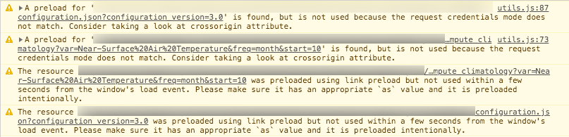
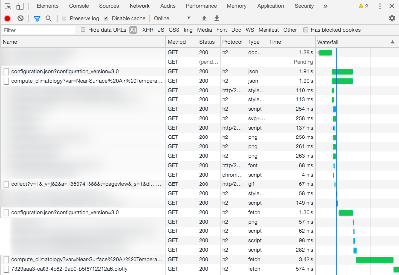
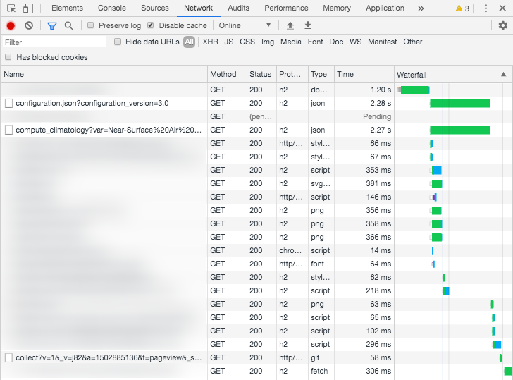

```toc
# This code block gets replaced with the TOC
exclude: Table of Contents
```

# Preamble

This is a new chapter in my search for optimal front-end performance using [resource preload](https://developer.mozilla.org/en-US/docs/Web/HTML/Preloading_content) using `link rel="preload"`.

To better understand the context see my previous article "[A walkthrough on prioritizing resources load using link preload](/link-preload-a-walkthrough/)".

# A `preload` regression

We left this Story with a super-happy version of me, proud of the performance boost obtained.

After some weeks and releases (we have a weekly release cycle in this project) I observed a _reduction_ of the Lighthouse score.

At the same time **our couple of preloaded resources stopped working!**

First of all we started getting again the Chrome warning that says "_The resource ... was preloaded using link preload but not used within a few seconds from the window's load event. Please make sure it has an appropriate `as` value and it is preloaded intentionally_".

In the previous article I said we added preloading of two resources:

* a `configuration.json` file request
* an execution process request

Both stopped working:



And this leads to doubled requests in the network waterfall:



As we learn in the last article there's only a rule of thumb: **preload works when request is exactly the same**, this means same parameters but (most tricky) same headers.

So what's happened here?
Let's inspect requests from both configuration calls.

This is the request run by the `preload`:

```python{9}
:authority: <...>
:method: GET
:path: <...>/configuration.json?configuration_version=3.0
:scheme: https
accept: */*
accept-encoding: gzip, deflate, br
accept-language: <...>
cache-control: no-cache
cookie: cookie-agreed=2; _ga=GA1.2.<...>; _gid=GA1.2.<...>; SSESS3<...>=<...>
pragma: no-cache
referer: <...>
sec-fetch-dest: empty
sec-fetch-mode: no-cors
sec-fetch-site: same-origin
user-agent: <...>
```

...and this is the canonical request (the one that should not be there at all 😡):

```python{9}
:authority: cds.climate.copernicus.eu
:method: GET
:path: <...>/configuration.json?configuration_version=3.0
:scheme: https
accept: */*
accept-encoding: gzip, deflate, br
accept-language: <...>
cache-control: no-cache
cookie: cookie-agreed=2; _ga=GA1.2.<...>; _gid=GA1.2.<...>; SSESS3<...>=<...>; _gat=1
pragma: no-cache
referer: <...>
sec-fetch-dest: empty
sec-fetch-mode: no-cors
sec-fetch-site: same-origin
user-agent: <...>
```

I put the focus on the only difference: **cookies**!
I omitted lot of stuff but trust me when I say omitted values are equals.

So, it seems we have found our problem: the [`_gat` cookie from Google Analytics](https://developers.google.com/analytics/devguides/collection/analyticsjs/cookie-usage?hl=it#analyticsjs).

This is a cookie with a lifetime of _one minute_; documentation says:

> "Used to throttle request rate."

If you are asking why we did not fall into this issue during the first article: because analytics has been added later, when we found that one of our applications was going viral.

We are using the classical Google Analytics script (`analytics.js`), not Google Tag Manager.
<br>
Even `_gid` cookie (lasts for 24 hours) or `_ga` (lasts for 2 years) are not optimal: if a link goes viral on social networks you should expect **many new users** and we want to optimize the page speed for these new visitors too.

But this is an issue for returning users too.
_One minutes_ are a very small timeout: a user moving from an application to another of our catalog will always (well... very very often) get an un-preloaded request.

Not good for anybody.

# The problem with Google Analytics

So what's the problem introduced by Google Analytics?

Look again at the network waterfall image above. I didn't blurred another request: a call to a `collect...`.

This is performed by Google Analytics and the fact that is performed _between_ preload and canonical requests is the core of the problem (not exactly the request itself, but what is done just before the request... see below).

Let me try to resume what's is going on (again: for simplicity I'm keeping focus on configuration only, but we have the same issue for the process run):

* Application's page is visited by the user
* At the very top of the page we have our `preload` link that's perform a fetch to configuration at high priority
* Near the top of our `head` HTML we have our newly added `<script>` tag for loading Google Analytics just after another script to activate it.
* ...Lot of other stuff is loaded...
* When ready, our JavaScript will try to load again the configuration file

You probably already know how GA is added to a site:

```html
<script>
window.ga=window.ga||function(){(ga.q=ga.q||[]).push(arguments)};ga.l=+new Date;
ga('create', 'UA-XXXXX-Y', 'auto');
ga('send', 'pageview');
</script>
<script async src='https://www.google-analytics.com/analytics.js'></script>
```

Note that `analytics.js` is loaded with the `async` attribute, so it will not block page and other resources to be loaded; we can say it is loaded at low priority.
This is OK because analytics must interfere with page speed as little as possible.

Removing the `async` attribute is not an option, nobody wants to have a page who freeze because an _external_ resource is not available (and a `script` tag without `async` is a blocker).<br>
Moving the script in a different location of the page is neither an option: with asynchronous operations we can't be sure what is loaded and executed first (and GA is commonly fast to be loaded).

Here is our problem in few words:

* Our `preload` request is performed at very high priority, when we don't have any cookies (and if we have them, `gat_` is probably expired)
* GA is run at low priority, but it's still faster that our application, so cookies are generated (and the GA request is also performed, but we don't care)
* Later our canonical `fetch` is executed by JavaScript, but _now_ we have new cookies.
  Request don't match with preload.
  Request repeated.
  Me sad.

So what we can do?

# A possible solution

There's a single line of code that trigger the issue:

```html{4}
<script>
window.ga=window.ga||function(){(ga.q=ga.q||[]).push(arguments)};ga.l=+new Date;
ga('create', 'UA-XXXXX-Y', 'auto');
ga('send', 'pageview');
</script>
<script async src='https://www.google-analytics.com/analytics.js'></script>
```

Removing the `ga('send', ...)` will make the issue to disappear, but analytics stops (no request to Google service is done).

I don't have any knowledge on how GA script is doing, but I observed that the `ga('send', ...)` operation is also the ones that generate cookies.

A possible solution for our problem is to **delay Google Analytics call**.

For example, let's change the activation script like follows:

```html{4-6}
<script>
window.ga=window.ga||function(){(ga.q=ga.q||[]).push(arguments)};ga.l=+new Date;
ga('create', 'UA-XXXXX-Y', 'auto');
function runGA() {
    ga('send', 'pageview');
}
</script>
```

In this pseudo-code the `ga('send', ...)` is not executed, just wrapped inside a callable function.

When our real fetch is performed we can then call `runGA` and make GA do its work (that's easy, we have some configurable hooks).

Finally we have `preload` working again!



## Brawbacks

This is all but perfect.

First of all: there's an important motivation why Google documentation suggest to put analytics stuff near the start of the page: the sooner it is loaded, the better is to start collecting stuff.

Another very important change this approach leads to: commonly **Google Analytics will intercept a page visit even is something is broken** in your page. It just need that your page loaded the GA JavaScript.
Instead now we introduced a **dependency** from our application to be correctly initialized and GA execution: if our application badly break before sending analytics data, we will lost activities from visitors.
