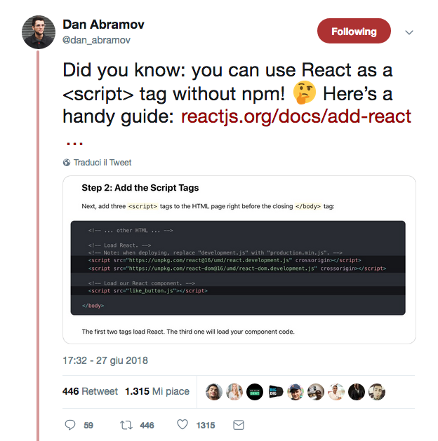

A complex React application I worked on, a set of widgets presented together, is composed by a single React app (let's call it **Widgets App**).
That means: a single `ReactDOM.render` call, like 95% of React applications out there probably.

Meanwhile the project evolved and we started working on a new side-application, an **Editor**, that's only make sense if used with the Widgets App.

To be more clear:

* Widgets App can be used independently from the IDE and should work on its own on dedicated page
* Editor needs Widgets App "inside"
* Editor and Widgets App needs to communicate

Let say that I'm not using `create-react-app`.
When this project started CRA was at version 1.x and I didn't liked it that much, I had to eject very early.
Lot of people say that version 2.x (3.x?) is a lot better.
I don't know.

When the Widgets App is used standalone there's no special cases to handle during the bundle (we use Webpack and Rollup for a reason, isn't it?).

Things gets more complicated when we have both React apps on the same page.

# Webpack and duplicated code

During the alpha phase of our project, when out needs was to present a working spike of the Editor app, we did not deal with the **duplicate code issue**.

This is one of the many problems that tools like Webpack removed from our daily work: in a common CRA or webpack environment all of your dependencies are wrapped in your bundle so (ideally) you can live with multiple copies of libraries on the same page.

It's a classical problem you need to address when using two different React app on a single page: if you handle them independently you are duplicating code: `react`, `react-dom` and probably other stuff will be **bundled twice**.
That's what we commonly call **vendors dependencies**.

That's not means this is OK.
For out project: we had to fix this before reaching the public beta stage.

One simple solution could be to inject React and ReactDOM as external `<script>` on the page.

[](https://twitter.com/dan_abramov/status/1012119124481277952)

This just works.
But I never liked that much the idea to rely on external CND service.
I don't care if they are 99.99997% uptime, because in the end it's _my_ uptime that really count.

Plus: the "_maybe it's already cached because I use CDN_" is not something I would bet on.

An article that sum up all of my concerns about self hosting: "[Self-Host Your Static Assets](https://csswizardry.com/2019/05/self-host-your-static-assets/)".

Another important point: the Editor is hosted inside an external CMS page (Drupal based, not under our control) and we _really_ needed to keep things simple with it: asking to add/change markup on that page is not something easy, and with a pretty long release-cycle change.

So: I want to distribute _my_ vendor stuff.

As the Widget App is **a requirement** for the Editor, it's OK for the Editor to **not work at all** without Widget app.

The solution was quite easy:

* Widgets App is bundling and externalizing vendors libs
* Editor is using external vendors libs it found on the page

## On the Widgets App

To do this we used a nice Webpack loader plugin: [expose-loader](https://github.com/webpack-contrib/expose-loader).

After the loader has been configured you can do something like this:

```javascript
require("expose-loader?libraryName!./thing.js");
```

What is cool is that it works also for dependencies, so:

```javascript
require('expose-loader?React!react');
require('expose-loader?ReactDOM!react-dom');
require('expose-loader?styled-components!styled-components');
```

Even more!
I have a couple of React components that I liked to use on both Editor and Widgets App.
How can I share them easily?

```javascript
require('expose-loader?myproject.components.Loadable!components/Loadable');
```

What is this `myproject`?
It's a global object we use to expose feature to the outside env (whatever it is).
We need this by design as the Widgets App need to expose some functions and a logger stream.
This webpack plugin can easily expose stuff inside objects too.

## On the Editor

On the Editor things are more mainstream: we just need to tell webpack to not bundle vendors dependencies using the [external configuration](https://webpack.js.org/configuration/externals/).

```javascript
...
    externals: {
    react: {
        root: 'React',
        commonjs2: 'react',
        commonjs: 'react',
        amd: 'react',
        umd: 'react',
    },
    'react-dom': {
        root: 'ReactDOM',
        commonjs2: 'react-dom',
        commonjs: 'react-dom',
        amd: 'react-dom',
        umd: 'react-dom',
    },
    'styled-components': {
        root: 'styled-components',
        commonjs2: 'styled-components',
        commonjs: 'styled-components',
        amd: 'styled-components',
        umd: 'styled-components',
    },
...
```

## Drawbacks

There's some drawbacks in this approach:

* We are polluting the global namespace
* The dependency from one app to the other is "too strong".

About the global namespace pollution... I don't give it much importance (at least for this project).
Let me be clear: it's a real problem and you must try to avoid it, but I also think that sometimes we are pushing this too hard especially if you are not building libraries.

This application is not running in a micro-frontend environment, putting stuff in the global is acceptable (although not ideal).

The latter drawback is more critical: we can't have different React (for example) versions for the two applications.

At some time I planned a migration of React and styled-components, and I was forced to do it on both the codebase.
It has been easy because of React, which it always a back compatibility hero, but it's not ideal.

## A better solution

There's a great solution that fix all of the issues above (plus other I did not mentioned, like the fact that I can use `async` attribute on `script` tags) and that we will probably embrace in the future: [async-define](https://engineering.tes.com/post/async-define/).

# Important Webpack configurations to know about

OK, so we have both applications on the same page up and running.
For while.

## Clashing chunks

As the Editor is a pretty big project I started very early to load chunks asynchronously to improve perceived performance and do not load by default lesser used features.

At some point the Widgets App started introducing some pretty heavy widgets.

The best example I can name is a [plotly.js](https://plot.ly/javascript/) based React component.
Plotly is a [huge library](https://bundlephobia.com/result?p=plotly.js); you don't need to load by default all of it's plugins (Plotly is well designed and splitted in many module you can load on request) but the core is still _a lot_ of KBytes.

So we introduced code splitting and async loading also for the Widgets App.
And we had new errors:

```
Uncaught (in promise) TypeError: Cannot read property 'call' of undefined
    at __webpack_require__
```

Inspecting `__webpack_require__`:

```javascript
modules[moduleId].call(module.exports, module, module.exports, hotCreateRequire(moduleId));
```

What I learned is that `modules` is a _global_ array of loadable modules but both **bundles were writing in the same array**.

Lesson learned: **by default, Webpack is not isolating your bundle so well** and is not OOTB configured to host multiple webpack based build on the same page.
Seems that every webpack bundle in the world write chunks inside a `webpackJsonp` global object.

Let me say this is well explained in the configuration (when you know what to search): you need to use the [output.jsonpFunction](https://webpack.js.org/configuration/output/#outputjsonpfunction).

After changing this value to something new chunks name collision issue disappeared:

```javascript
  output: {
    jsonpFunction: 'webpackJsonp_widgetsapp',
    ...
  },
```

## Type of hashing used for chunks

Webpack gives you the control over how to name your generated modules and chunks.

The configuration (by using the `chunkFilename` prop) can be something like this:

```javascript
  output: {
    jsonpFunction: 'webpackJsonp_widgets',
    chunkFilename: 'widgetsapp-[name]-[hash].chunk.js';
    ...
  },
```

What is the `hash` placeholder above?
Is one of the ways Webpack provides you to control the generation of unique names in your bundle, but is not the only one.

From the official documentation:

* **hash**: the hash of the module identifier
* **chunkhash**: the hash of the chunk content
* **contenthash**: the hash of the content of a file, which is different for each asset

Why generating unique values is important?
Because you can push front-end performance forward by providing **strong caching policy**.

The `hash` value is a simple solution, the only problem is it change for *every file* whatever small change I did.
Not that good.

The Application described here is quite huge and and we have a frequent release schedule.
At every new release, also for a minor change like fixing a typo in a `console.log` we got all of our bundle files invalidated.

Whit `chunkhash` things are better, but not that much: sometimes chunks of section *B* where invalidated while I only modified a simple stuff inside section *A*.

Why?
`chunkhash` is as hash based on the *whole file*, but a chunk file contains also some wrapper code added by webpack itself.
Adding new webpack split point, for example, can lead to a change of this wrapped code in _every_ chunk, so you can still see all of your chunks invalidated for very simple changes like a typo.

Another alternative is then `contenthash`, where the hash is based on the _content_.
You can find some articles that sponsor `contenthash` in favor of `chunkhash`, but read them carefully: this kind of hashing was originally designed for the ExtractTextPlugin plugin.

In facts: using this hash type lead me to a bug that hit old versions of the application.

The application source code is distributed from a single CDN service where every *major.minor* versions share the same filesystem directory.
This should not be a problem because we use unique file hashing, isn't it?

After a while, when a new chunk/split-point was added to the application, I found that the same hashed file name was generated for a slightly different content which, as I said above, is exactly how `contenthash` works.

For example: the old version of the file was something like:

```
(window.webpackJsonp_widgetsapp=window.webpackJsonp_widgetsapp||[]).push([[6],{"2d0274e27fde9220edd9"...
```

...while the new version was:

```
(window.webpackJsonp_widgetsapp=window.webpackJsonp_widgetsapp||[]).push([[7],{"2d0274e27fde9220edd9"...
```

As you can see the difference is only an index value: before was 6 and now 7.
But as far as these two files share the same filename and directory, uploading them in the same CDN remote directory means that the new one overrode the old.

This was obviously a huge problem for old versions of the application running on different stacks: an old version of the application is expecting to have the chunk loaded at index 6, but instead it was not here.

One solution could be to go back to `chunkhash`: maybe it's not ideal for super-effective caching, but at this point it's safer than this.

However Webpack gives you another chance.

As you seen above, Webpack is storing chunks in an array based on numerical index, while all this would not happen if chunk name/id would be used instead.

And this is possible thanks to the [chunkIds option](https://webpack.js.org/configuration/optimization/#optimizationchunkids).

Setting this value to `named` instead of the default (`natural`, which is the id based on usage order) is doing the magic:

```
(window.webpackJsonp_widgetsapp=window.webpackJsonp_widgetsapp||[]).push([["mywidget"],{"03b81338c3085d9847f6"
```

As you can see now we have a stable id, we don't care anymore about the usage order.

## General purpose chunks loading

At the beginning of this article I said that our applications are mainly running inside an hosting environment not under our control (Drupal based).

Running stuff generated by Webpack inside 3rd party product is not complex, but 90% of resource you find online starts from an `index.html` static file.

When you have to put your application inside another service, the generated `index.html` in your build is useless

xxx
