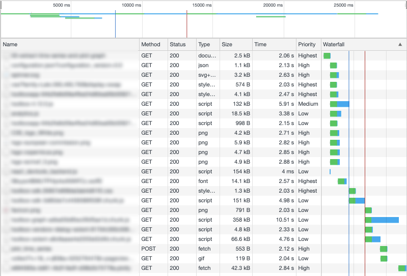
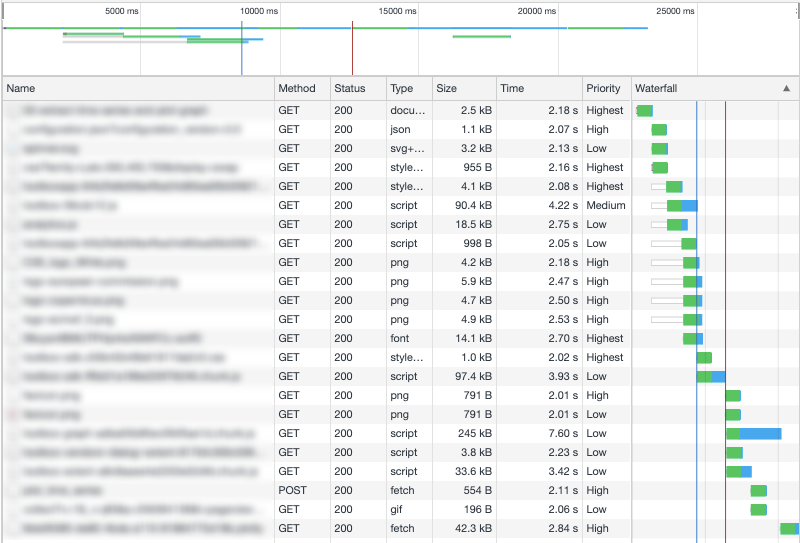

```toc
# This code block gets replaced with the TOC
exclude: Table of Contents
```

## Resume

We will not focus on just using brotli compression (the Web is full articles about this) but we will discuss how you can **improve compression more** (while reducing server CPU usage) by statically compressing your CSS and JavaScript.

## State of compression on the Web

Enabling gzip compression on HTTP is a de-facto default nowadays.
Every browser down to IE 6 (maybe even older) supports compression and if you `apt-get install whatever` web server you'll probably have gzip enabled by default.

The feature is simple:

- user ask for `http://domain.com/foo/bar` using it's browser
- web server take `/foo/bar`
- web server compress on the fly "bar" using [gzip](https://www.gnu.org/software/gzip/)
- web server returns the compressed "bar"
- browser extract the original "bar" before serving it to the user

Easy.

But compression is not something that the server should do automatically, because it's always possible that a browser (nah...) or a custom service access a resource without having gzip compression support.

So how the server can know when to compress?

On of the headers sent by the browser with every request is [`Accept-Encoding`](https://developer.mozilla.org/en-US/docs/Web/HTTP/Headers/Accept-Encoding).<br>
This header contains every supported compression method by the browser itself.

A standard value for thi header nowadays is

```
Accept-Encoding: gzip, deflate, br
```

As you can see `gzip` is there (but note that also `br` is there!) so the browser is saying "_Hey, I can handle gzip response_".

At this point the server _can_ compress the response (not every resource should be compressed by default, for example compressing images is a waste of time).<br>
In case it will, the server adds a response header: [Content-Encoding](https://developer.mozilla.org/en-US/docs/Web/HTTP/Headers/Content-Encoding)

A common value for this header can be:

```
Content-Encoding: gzip
```

So in this way the browser knows that he need to un-compress the response body.

Note that if the `Accept-Encoding` header is missing, or it not contains the `gzip` value, the server should not send gzipped response.

## Brotli

[Brotli](https://brotli.org/) is an alternative compression method that is slowly raising.

Although brotli is more CPU intensive, it has better compression benefits.
This is an _average_ gain:

- JavaScript files compressed with Brotli are 14% smaller than gzip
- HTML files are 21% smaller than gzip
- CSS files are 17% smaller than gzip

Both brotli and gzip have different compression level, so numbers above can vary a lot (Web is full of comparison articles, with different numbers).

What is important to know is that rarely live compression performed by a web server like Nginx uses the maximum compression level (for gzip or brotli either) because it can be too slow: having a server sending less KBytes but waiting to long to start the download process can be worst.

For more details take a look at ["Brotli Compression – How Much Will It Reduce Your Content?"](https://paulcalvano.com/index.php/2018/07/25/brotli-compression-how-much-will-it-reduce-your-content/).

### Why brotli adoption is still low?

If you take a random website and you inspect response headers you can bet it's still using gzip.

Although installing and enabling it on popular web server is now easy, adoption is still low probably due to [brotli support on browsers](https://caniuse.com/#feat=brotli).<br>
As you can see IE 11 can't take advantage of it.

So I guess this is why nginx or other web service are not enabling brotli by default.

If you read above you know that **supporting multiple compression methods is possible**, it's only a matter or compressing with different algorithms for different values of `Accept-Encoding`.<br>
So it can work but make configuration a little complex.

## Statically compress using brotli

Just enabling brotli on your website will give you benefits, but I don't want to stop here.

I'm working with an application served by a complex nginx configuration (generated by [puppet](https://puppet.com/)) on virtual environments.

In this environment we are still supporting IE 11 ([don't ask](https://canistop.net/)) and in any case installing brotli support is not so easy (a lot of systems involved).

My activities recently has been focused on how to make a single application page _faster_.<br>
Unluckily this application (a React based JavaScript) is quite slow at load time and in some configuration it requires huge libraries like [Plotly.js](https://plotly.com/javascript/) or [Leaflet](https://leafletjs.com/).<br>
Analytics data says that most of incoming traffic came from mobile (not a surprise).

So we pushed a lot on code splitting, webpack tuning, caching, and [resources preload](../link-preload-a-walkthrough/) and brotli would help us to improve even more.<br>
Note that I'm used to test my applications using **slow network throttling**: downloading a 300Kb JavaScript chunk of a 3G network is not an instant operation.

So as we can't (for now) enabling brotli at global level, can I **just serve my resources brotli compressed?**

The answer is _yes_!
I can pre-compress my resources offline!

### Benefits of statically compressed files

This is nothing new.

If you take the well know [react-boilerplate](https://github.com/react-boilerplate/react-boilerplate) (I'm not a big user of Create React App) this technique is already there out of the box: when you build you application you'll find `file.js` and `file.js.gz` for _every_ generated chunk and module.

Obviously when you use offline compression you can push on the compression level, which commonly you don't on nginx.

So, let's do this for brotli!

First of all, I need a way to compress to brotli, and this is not complex:

- by using [compression-webpack-plugin](https://webpack.js.org/plugins/compression-webpack-plugin/)
- by relying on node itself, as it has native brotli support, even if you are still on version 10.

The webpack configuration is easy:

```JavaScript{12}
const CompressionPlugin = require('compression-webpack-plugin');

//...

  plugins: [
    new CompressionPlugin({
    filename: '[path].br[query]',
    test: /\.(js|css)$/i,
    algorithm: 'brotliCompress',
    compressionOptions: {
        // zlib’s `level` option matches Brotli’s `BROTLI_PARAM_QUALITY` option.
        level: 11,
        threshold: 10240,
        minRatio: 0.8,
    },
    }),
  ]

// ...
```

Note that I'm using a very high compression level.

My nginx configuration is not so interesting because of complexity of the environment, but you can read of the approach reading ["Poor man’s Brotli: serve Brotli compressed files without a nginx module"](https://siipo.la/blog/poor-mans-brotli-serving-brotli-files-without-nginx-brotli-module).

Let me copy-paste the interesting part here:

```nginx
set $extension "";
if ($http_accept_encoding ~ br) {
    set $extension .br;
}

if (-f $request_filename$extension) {
    rewrite (.*) $1$extension break;
}

location ~ /*.css.br$ {
    gzip off;
    types {}
    default_type text/css;
    add_header Content-Encoding br;
    add_header Vary "Accept-Encoding";
}

location ~ /*.js.br$ {
    gzip off;
    types {}
    default_type application/javascript;
    add_header Content-Encoding br;
    add_header Vary "Accept-Encoding";
}
```

To resume:

- We check for `Accept-Encoding` to contains `br` (which is the code for brotli)
- We check for existence of the requests resource with `.br` appended
- If it exists:
  - we turn off gzip compression
  - we rewrite the request to serve this file
  - we set the proper `Content-Encoding`

The author of this excellent article is calling this a "poor man" approach, but I totally disagree: this is a great approach!

Why?

- we can still keeping gzip as default
- we can provide maximum compression level
- our nginx on the server is not wasting CPU cycles on compressing to gzip

### Show me numbers!

First of all let's show times.

As I said, fully load this application on a "slow 3G" network configuration, with cache disabled, take a lot of time (the application is responsive before of being fully loaded, but let's focus on when we reach the "no network activities" state):



As you can see it requires 27.5 seconds.

Moving all of our webpack generated bundle to brotli changed to this:



We lowered it to 23 seconds.

The page, with this type of network is still slow, but it's not easy to find a single change that can give you 4.5 seconds gain! 🙌

Now let's talk about saved bytes on the network.

This application is loading a lot of different chunks based on a configuration, so I registered changes of only some of them:

```
toolbox-xxx.js
Uncompressed:               331Kb
Nginx gzip:                 132Kb
Static brotli:              90.4Kb

toolbox-sdk.xxx.css
Uncompressed:               3.4Kb
Nginx gzip:                 1.3Kb
Static brotli:              1Kb

toolbox-sdk-xxx.chunk.js
Uncompressed:               428Kb
Nginx gzip:                 151Kb
Static brotli:              97.4Kb

toolbox-vendors~dialog~extent-xxx.chunk.js
Uncompressed:               14.4Kb
Nginx gzip:                 4.8Kb
Static brotli:              3.8Kb

toolbox-extent-xxx.chunk.js
Uncompressed:               216Kb
Nginx gzip:                 66.6Kb
Static brotli:              33.6Kb

toolbox-graph-xxx.chunk.js
Uncompressed:               905Kb
Nginx gzip:                 358Kb
Static brotli:              245Kb
```

For every entry I reported:

- the full uncompressed size
- the size downloaded by the browser before the change, so with gzip compression performed by nginx with an average compression level
- the size after the change, so with nginx just serving a super-compressed brotli source

Take a look just at the first entry, that is our main application file.

We went down of 50 KBytes!

## Conclusion

Use brotli.
Enable it and take your time to configure stuff for having both brotli and gzip working together (but with brotli as preferred compression method).

But don't stop here.

Statically compress you stuff and server it is easy enough (even if you don't use brotli).
