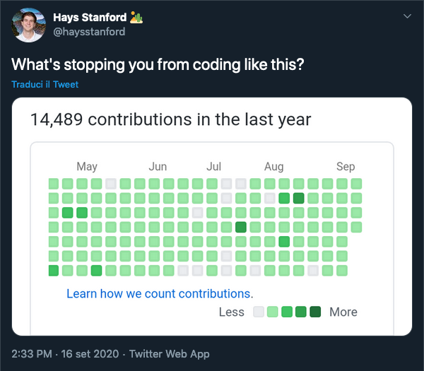
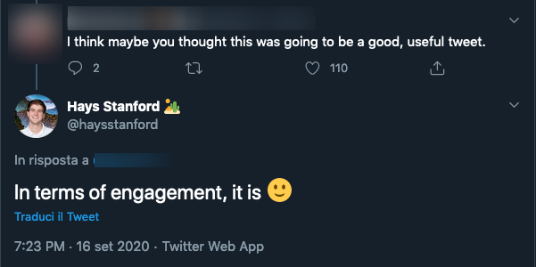
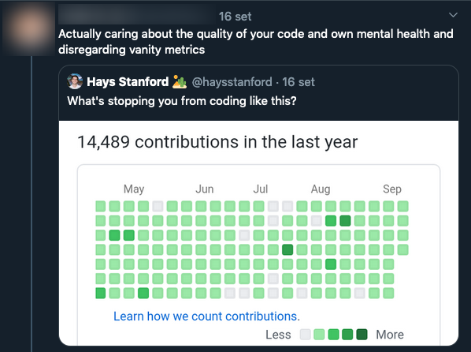
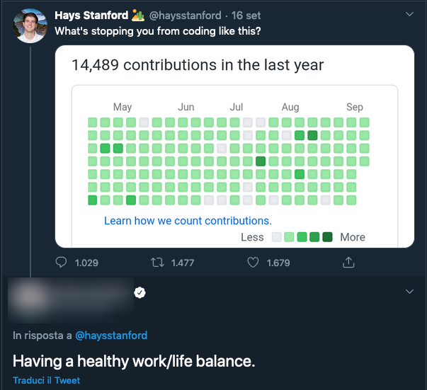
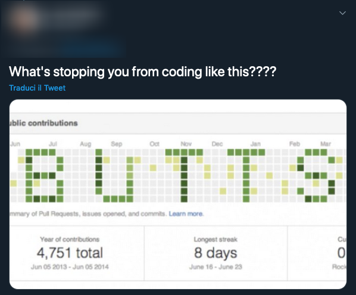
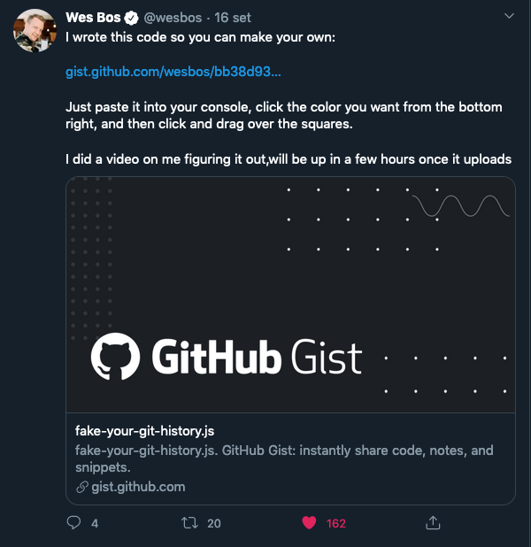
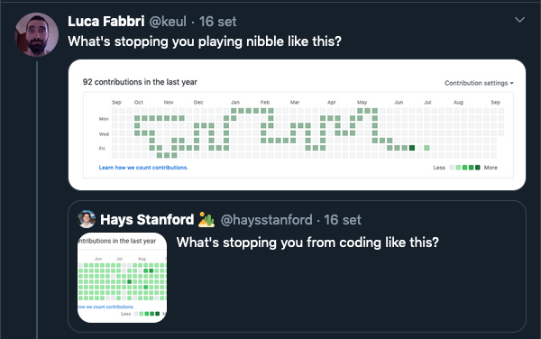
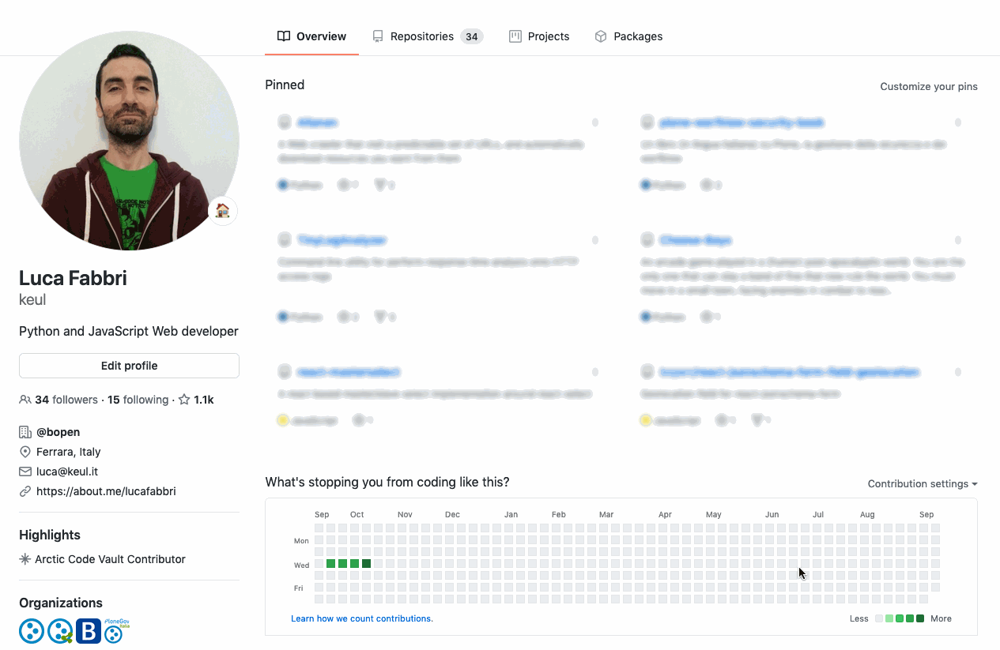

```toc
# This code block gets replaced with the TOC
exclude: Table of Contents
```

## Don't trust a developer that makes no jokes

Something like 10% of my life time is spent on making jokes.<br>
I'm not lying.

This is my official Slack profile description on our workspace:


So it's natural for me to like funny tweets, especially when smart people reply to "shitty" messages.

## "_What's stopping you from coding like this?_"

If you are on Twitter, you probably already seen this a couple of days ago:

[](https://twitter.com/haysstanford/status/1306209477226569729 "Hays Stanford Tweet")

Let me take up the defense of the author: I don't know the full context of this tweet and I appreciate he did not removed it after the shit-storm.

It's also possible this was just a (very successful) social media technique:



🤷‍♂️ who cares.
Life it too short for focusing too much on a Twitter-drama.

This tweet generated a set pissed off replies…



…and again…



But then funny people enter the game! 😆



…and again…

[](https://twitter.com/cassidoo/status/1306263579897688065?s=20 "Cassidoo tweet")

Then _genius_ come to play:

[](https://twitter.com/wesbos/status/1306254750757916672?s=20 "Wes Bos tweet")

So the guy above developed a [gist for faking your GitHub timeline](https://gist.github.com/wesbos/bb38d9311dd742eb8082cf138ec469da) and continue making those funny meme.<br>
This great piece of software is just a snippet you have to copy/paste in you browser development console and, thanks to this, I took part to the party.

## What's stopping you from playing nibble like this?

[](https://twitter.com/keul/status/1306263632448237568?s=20 "My tweet")

AHAHAHAH!!! What a funny guy I am!<br>
How nice it would be to play [nibble game](<https://en.wikipedia.org/wiki/Nibbles_(video_game)>) inside the GitHub commit history section?

It would not be too difficult, isn't it?
Maybe I can do it in few minutes!

…

Oh… fuck.



OK… I spent two nights developing this [gist for playing nibble inside GitHub](https://gist.github.com/keul/383a50f64a163a9c2f06d63eb0f08640) (included writing this article). 🤦‍♂️

If you want to play: it works in the same way as the other gist:

- Go to your GitHub profile
- Open the browser's console
- copy/paste the script and press enter
- click on the page (so remove focus from the console)
- press enter and try to become a 10x engineer

(_use arrows keys to control the snake or just smack into the wall_)

## Let me try to be serious… for a while

Now some professional notes.

### Ship it

The JavaScript gist code inside the gist **sucks**.

The initial implementation (that to be honest was working 95% like the current one) took me something like two hours, but when you have to share code to the public domain you'll be an inflexible judge of yourself… so I started a huge refactoring of it.

Yesterday I _started_ cleaning stuff up and making it more general purpose ("_This function should take an input parameter to…_") then I realized I was wasting my time (well… you can argue that the time for making this is wasted in every case, and I would probably agree) for a Twitter trend we all forget in few days.

You probably recognize the attitude…

> I'm a Web developer, I can't share a so-ugly code… it's a shame I'm using `for` loops and array iteration methods and bla bla bla

> What about making a web component of it?

> Svelte!

> Release on npm!

I can go on this way for ages.

[](https://twitter.com/vincentdnl/status/1268573228626333703?s=20)

Luckily I've not much free time so I just removed _very_ rough edges and [shipped it](https://medium.com/@kitze/the-saddest-just-ship-it-story-ever-b82707e37735).

Fell free to make it a better script, supporting game controller, make it compatible with mobile, rewrite it in Rust, reach singularity or whatever, …

### Final thoughts on the approach

The Web is an unique platform: you use it but you can always **modify it live**.
This even if on a very secure site like GitHub, that implements a content security policy.

There are sites build with technologies that make this hard, frameworks like Angular or React are less hackable from the outside, while the old good jQuery make it _very_ easy.

In any case: is this approach useful?

Well… It can be!

This is a behavior used by some simple browser's plugin, it's nothing new.

A recent case where we applied this for a customer: we were planning an integration of a other-company application with another application developed by us.<br>
The other-company application had to be enriched by adding a button that send an existing form to our application.

Instead of just discussing about this, we prepared a demo for the client: a JavaScript snippet has been run in the console and a button appeared in the other-company UI doing exactly what is was required.

That was not the "final" implementation (the Other Company did it in "The Framework They Used Way™") but this was a success for the demo.

Now… go to play nibble.

👋
